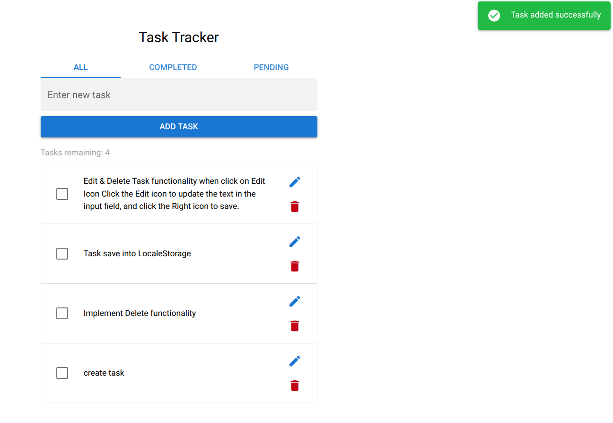
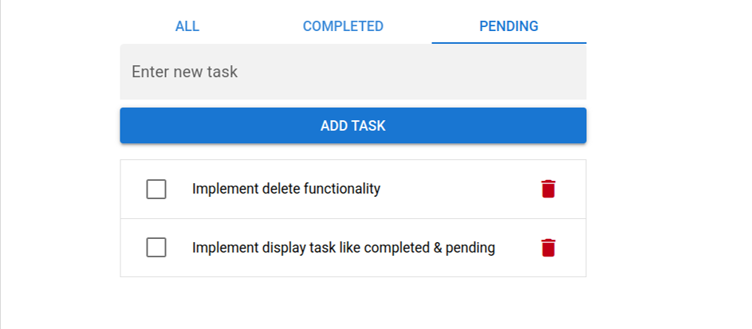
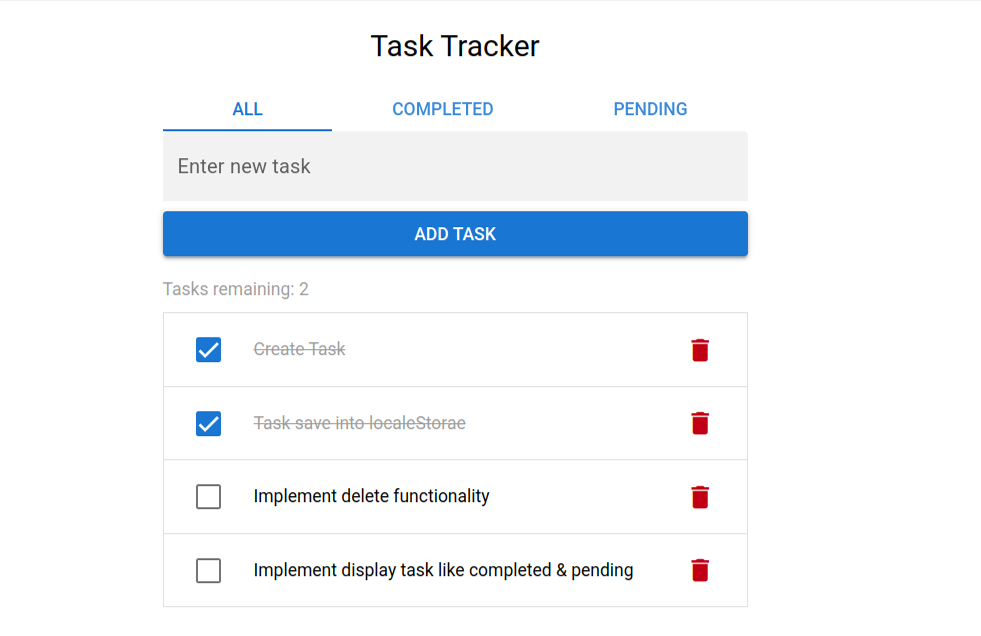

# Task Tracker App (Quasar + Vue 3)

This is a simple Task Tracker single-page application built using the Quasar Framework and Vue 3 Composition API.

---

## 🚀 Tech Stack Used

- Quasar Framework
- Vue 3 (Composition API)
- TypeScript
- Pinia (State Management)
- Vue Router
- SCSS
- Quasar LocalStorage Plugin

---

## ✨ Features

- Add new tasks (task name required)
- Mark tasks as completed or pending
- Delete tasks
- Filter tasks using routes:
  - /all
  - /completed
  - /pending
- Display number of pending tasks
- Persist tasks using localStorage
- Clean UI using Quasar components

---

## 📂 Project Structure

src/
├── components/
│ ├── AddTask.vue
│ ├── TaskItem.vue
│ ├── TaskList.vue
│ └── NavTabs.vue
│
├── pages/
│ ├── AllTasks.vue
│ ├── CompletedTasks.vue
│ └── PendingTasks.vue
│
├── stores/
│ └── taskStore.ts
│
└── router/
└── routes.ts

---

## ⚙️ Setup Instructions

```bash
npm install
quasar dev
```

## Screenshots

### All Tasks & Add Task



### Complited Task


### Pending Task



### Complited Marked Task


